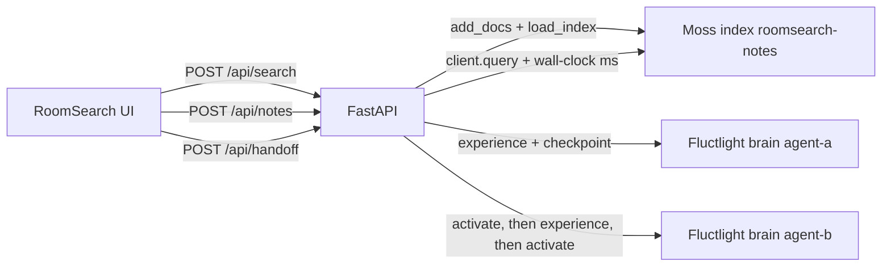

# RoomSearch

One-screen shared-room search for **YC Fall 2026 × Moss: The Zero Latency Builder Sprint**, Theme **2** (multiplayer AI and collaborative agents).

Agent A (Cartographer) or Agent B (Planner) asks a question. **[Moss](https://docs.moss.dev)** retrieves the shared notes and the screen shows wall-clock around `client.query`. **FluctlightDB** stores that turn and hands the episode to the other agent. Moss is the hot path. FluctlightDB is durable memory (`experience`, `activate`), not a vector database and not a stand-in for Moss.

Repo: [github.com/voxmastery/RoomSearch](https://github.com/voxmastery/RoomSearch).

| | |
| --- | --- |
| What | One screen, two agents, a shared room you can add to |
| Moss | Every search calls `client.query`. The pill is that latency |
| FluctlightDB | Episode written on the asking agent, then A→B handoff |
| Speed | p50 4.01 ms · p95 5.63 ms · p99 5.86 ms on the warmed index |
| Run | `MOSS_PROJECT_ID` and `MOSS_PROJECT_KEY` |
| Film | Header **Moss live**, pill **Moss · X.X ms** |

## Latency

Warmed in-process `client.query` after `load_index`, `top_k=5`. [Moss’s published FAQ workload](https://www.moss.dev/benchmarks) is **p50 3.1 ms · p95 4.3 ms · p99 5.4 ms**. RoomSearch measured the same call on `roomsearch-notes` (12 docs, N=150) on 2026-09-23:

| | p50 | p95 | p99 | under 10 ms |
| --- | ---: | ---: | ---: | ---: |
| RoomSearch wall-clock | 4.01 ms | 5.63 ms | 5.86 ms | 100% |

Hardware, the published comparison table, and how to rerun: [docs/BENCHMARKS.md](docs/BENCHMARKS.md).

## Run

Python 3.10+ and Node 20+.

```bash
python3 -m venv .venv
.venv/bin/pip install -r requirements.txt
npm install
cp .env.example .env
```

Fill the two Moss keys from [portal.usemoss.dev](https://portal.usemoss.dev). Names match `.env.example`:

| Variable | When |
| --- | --- |
| `MOSS_PROJECT_ID` | Required for a live Moss query |
| `MOSS_PROJECT_KEY` | Required for a live Moss query |
| `MOSS_CACHE_PATH` | Optional index cache directory |
| `ROOMSEARCH_DATA` | Optional brain and journal directory (default `./data`) |
| `DEMO_MOCK_MOSS` | Set to `1` only when both keys are empty. The UI says **Mock** |

```bash
npm run dev
```

- UI: [http://127.0.0.1:43123](http://127.0.0.1:43123)
- API: [http://127.0.0.1:43124](http://127.0.0.1:43124)

Vite proxies `/api` to `uvicorn server.main:app`. On boot the API upserts `roomsearch-notes`, calls `load_index`, and runs one warmup query. The header then reads **Moss live**. The first boot can spend time downloading the embedding model.

Brains live at `data/brains/agent-a` and `data/brains/agent-b`. The episode journal is `data/journal.json`. Both are gitignored.

Without keys, search stays off and the banner says to set them. Nothing in that state is labeled Moss. Rehearsal only:

```bash
npm run demo:mock
```

Checks: `npm run build` and `.venv/bin/pytest`.

## Deploy

Hosted URL: TBD.

`Dockerfile` builds the Vite app and serves it from the same FastAPI process. [`render.yaml`](render.yaml) is the Render blueprint (`healthCheckPath: /api/health`).

1. [Render blueprint](https://dashboard.render.com/select-repo?type=blueprint): choose `voxmastery/RoomSearch`. Set `MOSS_PROJECT_ID` and `MOSS_PROJECT_KEY` in the dashboard. Do not commit them.
2. Railway: deploy this repo. Set the same two variables. The Dockerfile is the start command.
3. Fly: `fly launch --dockerfile Dockerfile`, then `fly secrets set MOSS_PROJECT_ID=… MOSS_PROJECT_KEY=…`.

`GET /api/health` returns ok while the index warms. `GET /api/status` reports `moss.ready: true` when the badge can read **Moss live**.

## Architecture



| Path | Call | On screen |
| --- | --- | --- |
| Add note | `add_docs` with `MutationOptions(upsert=True)`, then `load_index` | Toast with the new doc count, then a search of the title |
| Search | `MossClient.query("roomsearch-notes", query, QueryOptions(top_k=5, alpha=0.75))` | Source cards and `Moss · X.X ms` (`moss.latencyMs`) |
| After search | Fluctlight `turn_begin`, `wm_push`, `experience` (`provenance_kind="tool_grounded"`), `turn_end`, `checkpoint` | Episodes rail, `roomsearch://agent-a/search` |
| Switch A → B | `activate` on A, `experience` into B, `activate` on B | Activated rail, `fluctlight://agent-a/engram/…` |

The Python API holds both SDKs. The project key never reaches the browser. UI stack: Vite, React, TypeScript.

Seed notes are a field week for an open-source trip atlas (Lisbon dinner, Kyoto rail, tile cache, hike weather). Twelve documents in `server/seed.py`. Notes you add append to that same index. B’s next search still calls Moss.

## Add a note

**Add a note to the room** opens a panel on the empty screen, and again when a search has no hit. Title and body, a pasted note (the first line becomes the title), an optional category, or a `.txt` / `.md` file. PDF files are not accepted.

Submit **Add to room**. That is `POST /api/notes`. The API validates the text, mints an id that cannot replace a seed document, and upserts into `roomsearch-notes` the same way boot does (`add_docs` + `load_index`). The response is the doc id and the new count. The project key stays on the server. Note text and credentials are not logged.

```json
{ "title": "Porto bakery stop", "text": "Manteigaria for pastel de nata.", "topic": "Food" }
```

The screen toasts the count, refreshes `GET /api/status`, and searches the title. With live keys the pill reads **Moss · X.X ms** for that query. The twelve seed notes stay in the index. In the labeled mock (`DEMO_MOCK_MOSS=1`, no keys) the new note is searchable for the life of the process and the pill says **Mock**.

## Agent chat

**Message Agent A** (or B) posts to `POST /api/chat`. The handler runs the same Moss query as search, writes a grounded reply from the hits, and stores that turn with Fluctlight `experience`. The trace still shows **Moss · X.X ms** on a live query. **Switch to Agent B** is the existing handoff: `activate` on the source, write, `activate` on the destination.

## Film

Shot list: [docs/DEMO_SCRIPT.md](docs/DEMO_SCRIPT.md). Product notes: [docs/PRD.md](docs/PRD.md).

Hold the **Moss query** row. The pill reads `Moss` only when the keys are set and the header says **Moss live**. `npm run demo:mock` is rehearsal: the pill says **Mock**.

## Screenshots

Light UI. With both Moss keys set, the header reads **Moss live** and the timeline pill reads **Moss · X.X ms**.


