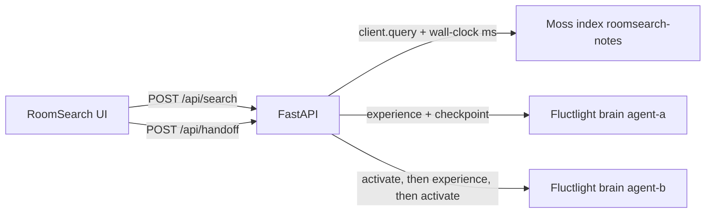

# RoomSearch

Shared-room search for the YC Fall 2026 × Moss Zero Latency Builder Sprint.

One screen. Agent A or Agent B asks a question. **Moss** retrieves the shared notes and the UI shows the measured `query()` latency. **FluctlightDB** stores the turn on that agent's brain. Switching agents activates the previous episodes and writes them onto the other brain.

Moss is the hot path. FluctlightDB is the durable handoff. They are not substitutes.

Source: [github.com/voxmastery/RoomSearch](https://github.com/voxmastery/RoomSearch).

## Latency

The claim is warmed in-process `client.query` after `load_index`, not a cloud round trip. [Moss's published FAQ workload](https://www.moss.dev/benchmarks) is **p50 3.1 ms · p95 4.3 ms · p99 5.4 ms** (`top_k=5`, index loaded). RoomSearch measured the same call on the 12-note index on 2026-09-23:

| | p50 | p95 | p99 | under 10 ms |
| --- | ---: | ---: | ---: | ---: |
| RoomSearch wall-clock, N=150, `top_k=5` | 4.01 ms | 5.63 ms | 5.86 ms | 100% |

Full table, hardware, and how to rerun: [docs/BENCHMARKS.md](docs/BENCHMARKS.md).

## Public deploy

The container in `Dockerfile` builds the Vite app and serves it from the same FastAPI process (`/api/*` plus the static UI). Render can run that image from this repo.

There is no hosted URL yet. This environment cannot log in to Render, Railway, or Fly. To publish one:

1. Open [dashboard.render.com/select-repo?type=blueprint](https://dashboard.render.com/select-repo?type=blueprint) and choose `voxmastery/RoomSearch` (`render.yaml` is the blueprint).
2. When Render asks for environment variables, set `MOSS_PROJECT_ID` and `MOSS_PROJECT_KEY` to the same values as local `.env`. Do not commit those values. `.env` stays gitignored. `.env.example` stays empty placeholders.
3. Wait until `/api/health` is ok. The first boot upserts the Moss index `roomsearch-notes`, so `/api/status` may say `mode: live` with `ready: false` for a minute. When `ready` is true, the header badge reads **Moss live**.
4. Search once. The latency pill is wall-clock around `client.query`.

Railway: New Project → Deploy from GitHub repo `voxmastery/RoomSearch` → add the same two variables → the Dockerfile is the start command. Fly: `fly launch --dockerfile Dockerfile` in a logged-in Fly account, then `fly secrets set MOSS_PROJECT_ID=… MOSS_PROJECT_KEY=…`.

## Architecture



| Path | System | What the screen shows |
| --- | --- | --- |
| Every search | Moss `client.query` | Source cards and `Moss · X.X ms` |
| After each search | Fluctlight `experience` / `wm_push` / `checkpoint` | Episodes rail, with agent and source URI |
| Switch A → B | Fluctlight `activate` on A, write into B, `activate` on B | Activated rail, provenance `fluctlight://agent-a/engram/…` |

The Python API owns both SDKs so the project key never reaches the browser. The UI is Vite + React + TypeScript.

Seed notes are a collaborative field week for an open-source trip atlas (Lisbon, Kyoto rail, tile cache, hike weather). Twelve documents. See `server/seed.py`.

## Run locally

Python 3.10+ and Node 20+.

```bash
python3 -m venv .venv
.venv/bin/pip install -r requirements.txt
npm install
cp .env.example .env
```

Put Moss credentials in `.env` or the shell. Create them at [portal.usemoss.dev](https://portal.usemoss.dev).

```bash
export MOSS_PROJECT_ID="your_project_id"
export MOSS_PROJECT_KEY="your_project_key"
npm run dev
```

- UI: [http://127.0.0.1:43123](http://127.0.0.1:43123)
- API: [http://127.0.0.1:43124](http://127.0.0.1:43124)

`npm run dev` starts Vite and `uvicorn server.main:app`. The UI proxies `/api` to the API.

On startup with keys, the API upserts `roomsearch-notes`, loads it, and runs one warmup query so the filmed search is the hot path. The header badge reads **Moss live** when that finishes. The first boot can take a while while the embedding model downloads.

Brains are created at `data/brains/agent-a` and `data/brains/agent-b`. A journal of episode cards for the rail lives in `data/journal.json`. Both are gitignored.

### Keys missing

The app still boots. Search stays disabled and the banner says to set the Moss keys. Nothing in that mode is presented as Moss.

Rehearsal without keys, explicitly labeled mock:

```bash
DEMO_MOCK_MOSS=1 npm run dev
# or
npm run demo:mock
```

The badge, banner, and latency pill all say **Mock**. The pill is wall-clock around a local keyword overlap, not `client.query`.

### Checks

```bash
npm run build
.venv/bin/pytest
```

## What a search does

1. `MossClient.query("roomsearch-notes", query, QueryOptions(top_k=5, alpha=0.75))`
2. Wall-clock around that call is `latencyMs`. The SDK field `time_taken_ms` is `engineMs` when present.
3. The active brain: `turn_begin`, `wm_push`, `experience` (`provenance_kind="tool_grounded"`), `turn_end(flush=True)`, `checkpoint`.

## What a handoff does

1. `activate(cue)` on the source brain for each recent episode.
2. `experience` each recalled episode into the destination brain. `source_uri` is `fluctlight://{from}/engram/{id}`.
3. `checkpoint` both brains.
4. `activate(cue)` on the destination brain. Those recalls are the Activated rail.

B's next search still calls Moss.

## Demo

Shot list: [docs/DEMO_SCRIPT.md](docs/DEMO_SCRIPT.md). Product notes: [docs/PRD.md](docs/PRD.md).

Film the **Moss query** row. The green pill is the number to hold on. It only reads `Moss` when the keys are set and the badge says Moss live.

## Screenshot

The frames below are the light UI. With `MOSS_PROJECT_ID` and `MOSS_PROJECT_KEY` set, the header reads **Moss live** and the timeline pill reads **Moss · X.X ms**. `DEMO_MOCK_MOSS=1` uses the same layout and labels the pill **Mock**. Shot list: [docs/DEMO_SCRIPT.md](docs/DEMO_SCRIPT.md).


